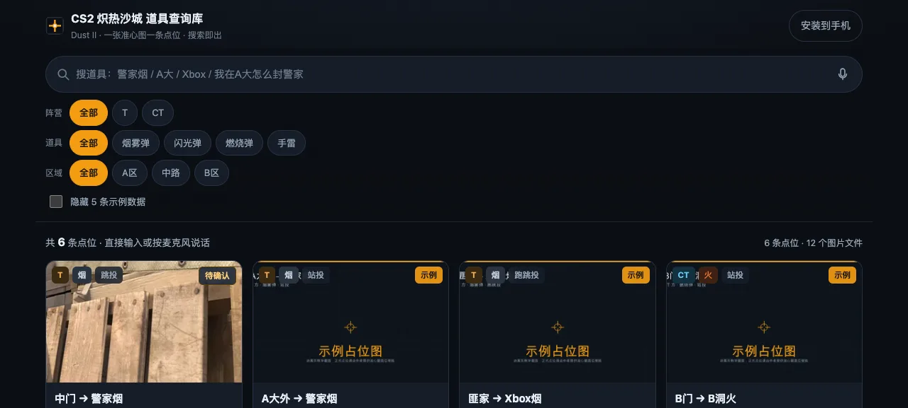
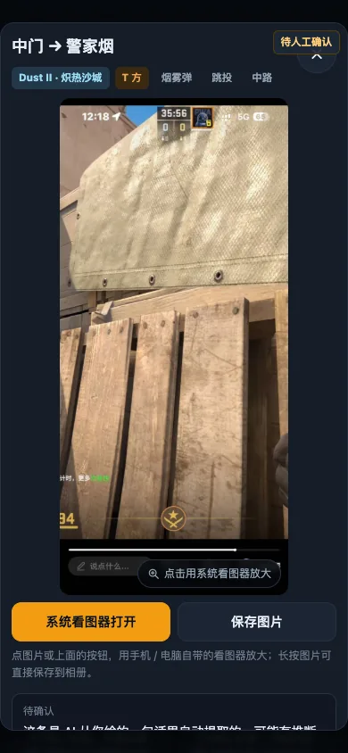
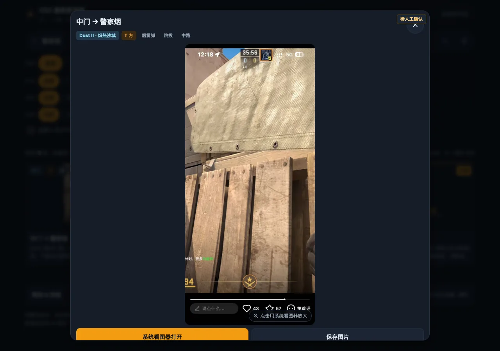

# CS2 炽热沙城 道具查询库

游戏里来不及翻视频？打开网页，输一句话就能看到准心该瞄哪儿。

- **纯静态**：React + TypeScript + Vite，构建产物是静态文件，托管在 GitHub Pages。
- **无后端**：不需要数据库、不需要云服务、不需要在线管理后台，家里电脑关机也能访问。
- **一条点位一张图**：每张图就是「准心该对准哪里」的截图，不要求站位图/落点图/多步骤图。
- **PWA**：可添加到手机主屏幕，像 App 一样打开；缓存后可离线查询。
- **搜索**：支持关键词、别名、自然句（「我在A大怎么封警家」），支持语音输入。

## 线上地址

> 部署完成后填写：`https://66liuzi.github.io/<仓库名>/`

## 界面预览

| 电脑 | 手机 | 准心大图 |
| --- | --- | --- |
|  |  |  |

## 怎么用

1. 电脑/手机浏览器打开上面的网址。
2. 直接在搜索框输入：`警家烟`、`A大`、`Xbox`、`我在A大怎么封警家`、`CT在B门怎么防B洞Rush`。
3. 点结果卡片看大图，手机可双指缩放查看准心细节。
4. 手机想当 App 用：iPhone 用 Safari → 分享 → 添加到主屏幕；安卓用 Chrome → 菜单 → 添加到主屏幕 / 安装应用。
5. 断网也能查：先点底部「离线保存全部点位」，之后即使断网，搜索和已缓存的准心图都还能用。

## 目录结构

```
src/
  data/
    lineups.json      # 所有点位数据（唯一需要改的内容文件）
    synonyms.ts       # 同义词与区域映射（加新说法只改这里）
    types.ts          # 字段类型定义
    imageSizes.json   # 图片统计（脚本自动生成）
  lib/
    search.ts         # 分词 + 打分 + 排序
    pwa.ts            # Service Worker / 安装 / 离线控制
    voice.ts          # 语音输入（含降级提示）
  components/         # 界面组件
public/
  images/dust2/       # 准心瞄点图（WebP 主图 + 缩略图）
  icons/              # PWA 图标
  manifest.webmanifest
  offline.html
scripts/
  add-lineup.mjs      # 新增点位助手（AI 用）
  process_image.py    # 图片优化：转正方向、压到 1920、生成 WebP 与缩略图
  validate-lineups.mjs# 数据体检（构建前自动跑）
  gen-image-sizes.mjs # 统计图片体积
  make_placeholders.py# 生成「示例占位图」
  make_icons.py       # 生成 PWA 图标
  sw.template.js      # Service Worker 源文件（构建时生成 public/sw.js）
```

## 本地开发

```bash
npm install
npm run dev        # 本地预览
npm test           # 搜索逻辑测试（含验收用例）
npm run build      # 正式构建（先自检再打包）
npm run preview    # 预览构建结果
```

## 新增一个点位（推荐交给 AI）

把**一张准心图和一句说明**发给 AI 即可，例如：

> 这张图是 T 方从 A大外 扔 警家烟，烟雾弹，站投。贴住墙角，按图片里的准心位置直接左键投掷。

AI 会自动完成：解析字段 → 补充搜索别名 → 查重 → 优化图片（转正方向 / WebP / 缩略图）→ 写入 `lineups.json` → 跑测试与构建 → 提交推送 GitHub → 等 Pages 自动部署 → 告诉你线上链接。

手动执行等价于：

```bash
node scripts/add-lineup.mjs \
  --image ~/Downloads/xxx.jpg \
  --desc "T方从A大外扔警家烟，站投，贴住墙角按图片准心直接左键"
```

信息不全时脚本会明确列出缺什么（阵营 / 起点 / 目标 / 道具 / 投法），只问这些。

## 数据字段

| 字段 | 说明 |
| --- | --- |
| id | 唯一编号，如 `d2-t-mid-ctspawn-smoke-0001` |
| map | `Dust II/炽热沙城` |
| side | `T` / `CT` |
| startLocation | 起始位置 |
| targetLocation | 投掷目标 |
| grenadeType | 烟雾弹 / 闪光弹 / 燃烧弹 / 手雷 |
| throwMethod | 站投 / 跳投 / 跑投 / 跑跳投 / 其他 |
| description | 简短操作说明 |
| aliases | 搜索别名数组（自动补充） |
| image | 准心图（`images/dust2/xxx.webp`） |
| thumbnail | 列表缩略图 |
| zone | `A` / `MID` / `B`（用于筛选） |
| createdAt / updatedAt | 录入 / 更新日期 |
| source | 可选，原始视频或网页 |
| needsReview | 是否待人工确认 |
| isSample | 是否示例数据（界面会明显标注，可一键隐藏） |

## 搜索排序规则

1. 标题或别名完全匹配
2. 起点 + 目标同时匹配
3. 目标位置匹配
4. 起始位置匹配
5. 道具类型匹配
6. 投掷方法匹配
7. 说明文字匹配

分词只认词库里的词，并且会自动丢掉「我在 / 怎么 / 有没有 / 帮我找 / 用什么 / 扔一个 / 给我看 / 哪里有」这类废话词，所以搜「家」不会刷出一堆无关点位。

## 部署

已配置 `.github/workflows/deploy.yml`：推送到 `main` 分支后自动测试、构建、发布到 GitHub Pages。
Pages 的 Source 需要设为 **GitHub Actions**（仓库 Settings → Pages）。

## 示例数据

首次体验包含 5 条明显标注为「示例占位图」的记录，图片是程序生成的占位图，**不是真实教学截图**。
界面底部可勾选「隐藏示例数据」；正式录入真实点位后，一条命令即可清掉示例（连占位图一起删）：

```bash
node scripts/remove-samples.mjs --yes
```

## 依赖说明

- 构建/运行：Node 18+。
- 图片处理脚本：Python 3 + Pillow（macOS 自带 `/usr/bin/python3` 已具备；缺失时
  `/usr/bin/python3 -m pip install --user Pillow`）。
- 新增点位脚本 `scripts/add-lineup.mjs` 需要 Node 22.18+（直接读 `synonyms.ts`）。

## 许可

点位数据与图片归作者所有，仅供个人查询使用。
